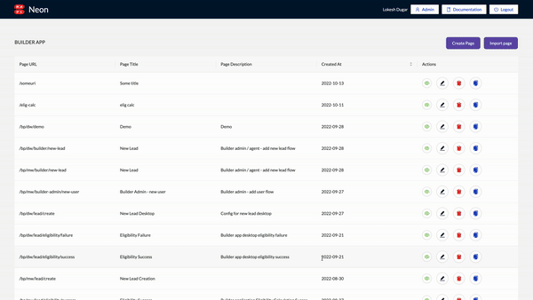

# 📸 Preview on Neon

Preview option is avaialble on neon for the look and feel of the page. This can be done in two modes - mobile and desktop

There are two preview options  -&#x20;

* A preview button is available (bottom of the page where you are creating configs) to review changes before saving them.&#x20;
* Preview action is also available in the page list table

<figure><figcaption>
Preview
</figcaption></figure>

